# ADK Learning Workspace

If you've stumbled upon this repo, just a heads-up: **there's nothing groundbreaking to see here.** 

I'm using this workspace to follow along with the Google Cloud ADK (Agent Development Kit) curriculum. It's just a collection of non-proprietary, personal learning exercises and basic LLM agents as I go through the tutorials. 

Feel free to poke around if you're curious about what the ADK looks like. 

## Agents Overview

Each agent in this repository demonstrates a different pattern or capability of the ADK. Below are the orchestration and logic flows for each agent.

### 1. Customer Support
Handles inquiries about orders and refunds with comprehensive error handling.
[Detailed Documentation](./customer_support/diagram.md)

#### Orchestration Sequence
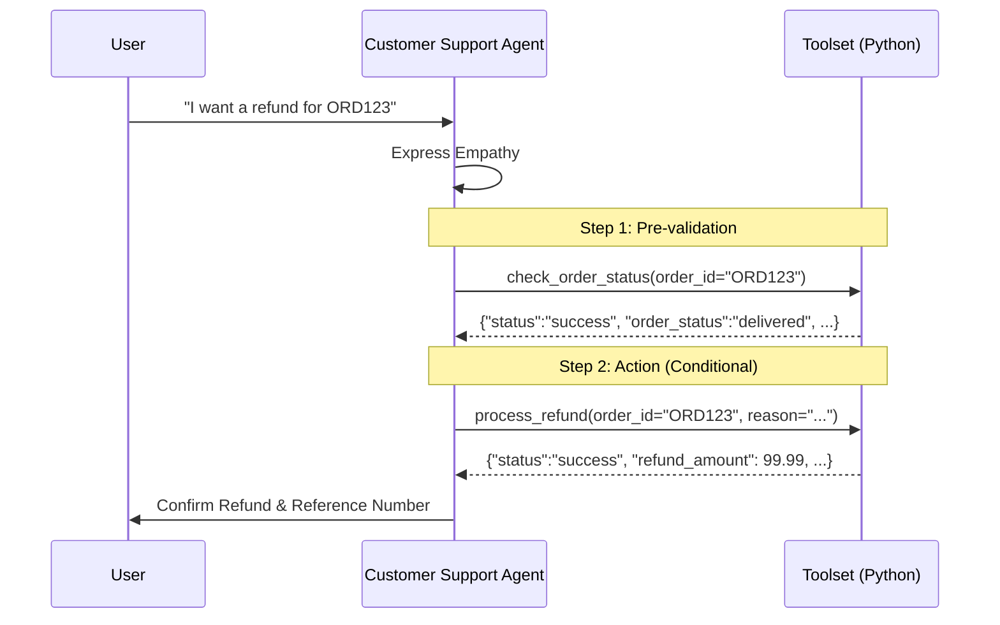
```mermaid
sequenceDiagram
    participant User
    participant Agent as Customer Support Agent
    participant Tools as Toolset (Python)

    User->>Agent: "I want a refund for ORD123"
    Agent->>Agent: Express Empathy
    
    Note over Agent,Tools: Step 1: Pre-validation
    Agent->>Tools: check_order_status(order_id="ORD123")
    Tools-->>Agent: {"status":"success", "order_status":"delivered", ...}

    Note over Agent,Tools: Step 2: Action (Conditional)
    Agent->>Tools: process_refund(order_id="ORD123", reason="...")
    Tools-->>Agent: {"status":"success", "refund_amount": 99.99, ...}
    
    Agent->>User: Confirm Refund & Reference Number
```

#### Decision Logic Flow
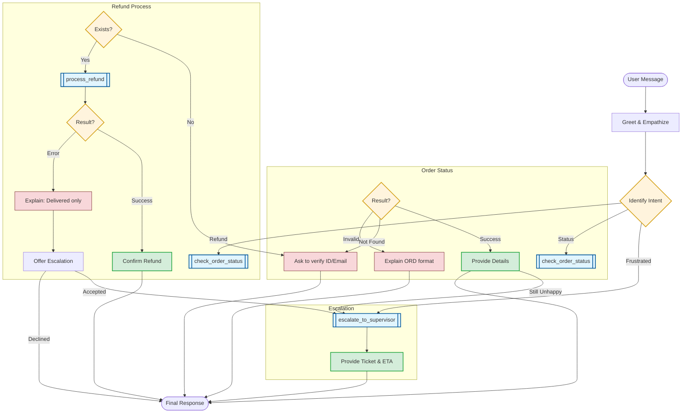
```mermaid
flowchart TD
    Start([User Message]) --> Greet[Greet & Empathize]
    Greet --> Intent{Identify Intent}

    subgraph Status [Order Status]
        CallStatus1[[check_order_status]]
        StatusResult1{Result?}
        StatusResult1 -- Success --> ProvideDetails[Provide Details]
        StatusResult1 -- Not Found --> AskVerify[Ask to verify ID/Email]
        StatusResult1 -- Invalid --> ExplainFormat[Explain ORD format]
    end

    subgraph Refund [Refund Process]
        CallStatus2[[check_order_status]]
        StatusResult2{Exists?}
        StatusResult2 -- No --> AskVerify
        StatusResult2 -- Yes --> CallRefund[[process_refund]]
        
        CallRefund --> RefundResult{Result?}
        RefundResult -- Success --> ConfirmRefund[Confirm Refund]
        RefundResult -- Error --> ExplainPolicy[Explain: Delivered only]
        ExplainPolicy --> OfferEscalation[Offer Escalation]
    end

    subgraph Escalation [Escalation]
        CallEscalate[[escalate_to_supervisor]]
        ProvideTicket[Provide Ticket & ETA]
    end

    Intent -- Status --> CallStatus1
    Intent -- Refund --> CallStatus2
    Intent -- Frustrated --> CallEscalate
    
    OfferEscalation -- Accepted --> CallEscalate
    ProvideDetails -- "Still Unhappy" --> CallEscalate
    
    CallEscalate --> ProvideTicket

    %% End States
    ProvideDetails --> End([Final Response])
    AskVerify --> End
    ExplainFormat --> End
    ConfirmRefund --> End
    OfferEscalation -- Declined --> End
    ProvideTicket --> End

    %% Styling
    classDef tool fill:#e1f5fe,stroke:#01579b,stroke-width:2px;
    classDef decision fill:#fff4dd,stroke:#d4a017,stroke-width:2px;
    classDef success fill:#d4edda,stroke:#28a745,stroke-width:2px;
    classDef failure fill:#f8d7da,stroke:#721c24,stroke-width:1px;

    class CallStatus1,CallStatus2,CallRefund,CallEscalate tool;
    class Intent,StatusResult1,StatusResult2,RefundResult decision;
    class ProvideDetails,ConfirmRefund,ProvideTicket success;
    class AskVerify,ExplainFormat,ExplainPolicy failure;
```

---

### 2. Support Specialist (Alex Chen)
Professional support agent with strict identity and quality boundaries.
[Detailed Documentation](./customer_support_agent/diagram.md)

#### Orchestration Sequence
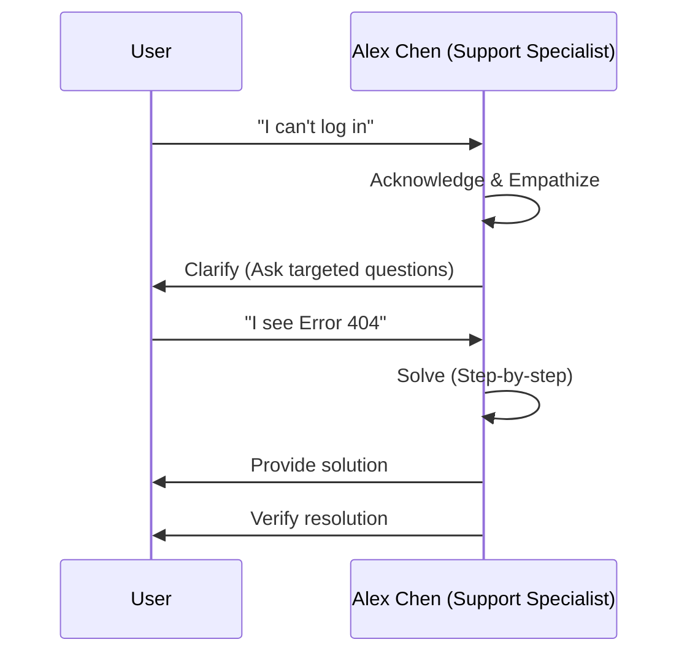
```mermaid
sequenceDiagram
    participant User
    participant Agent as Alex Chen (Support Specialist)

    User->>Agent: "I can't log in"
    Agent->>Agent: Acknowledge & Empathize
    Agent->>User: Clarify (Ask targeted questions)
    User->>Agent: "I see Error 404"
    Agent->>Agent: Solve (Step-by-step)
    Agent->>User: Provide solution
    Agent->>User: Verify resolution
```

#### Decision Logic Flow
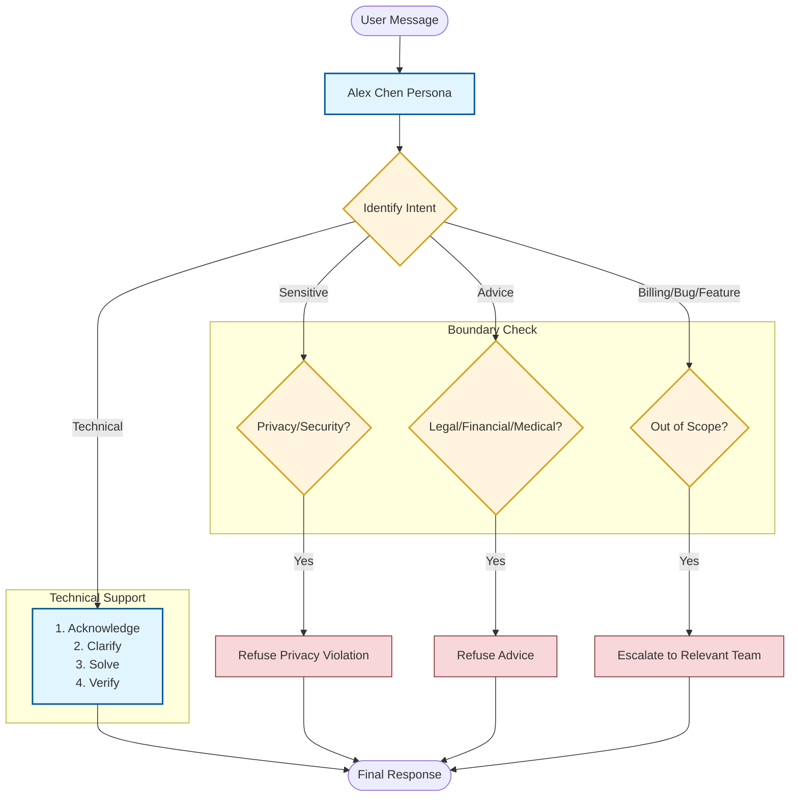
```mermaid
flowchart TD
    Start([User Message]) --> Identity[Alex Chen Persona]
    Identity --> Intent{Identify Intent}

    subgraph Support [Technical Support]
        Methodology[1. Acknowledge<br/>2. Clarify<br/>3. Solve<br/>4. Verify]
    end

    subgraph Boundaries [Boundary Check]
        PvtCheck{Privacy/Security?}
        LegalCheck{Legal/Financial/Medical?}
        ScopeCheck{Out of Scope?}
    end

    Intent -- Technical --> Methodology
    Intent -- Sensitive --> PvtCheck
    Intent -- Advice --> LegalCheck
    Intent -- Billing/Bug/Feature --> ScopeCheck

    PvtCheck -- Yes --> Refuse[Refuse Privacy Violation]
    LegalCheck -- Yes --> RefuseAdvice[Refuse Advice]
    ScopeCheck -- Yes --> Escalate[Escalate to Relevant Team]
    
    Methodology --> End([Final Response])
    Refuse --> End
    RefuseAdvice --> End
    Escalate --> End

    %% Styling
    classDef boundary fill:#f8d7da,stroke:#721c24,stroke-width:1px;
    classDef process fill:#e1f5fe,stroke:#01579b,stroke-width:2px;
    classDef decision fill:#fff4dd,stroke:#d4a017,stroke-width:2px;

    class PvtCheck,LegalCheck,ScopeCheck,Intent decision;
    class Methodology,Identity process;
    class Refuse,RefuseAdvice,Escalate boundary;
```

---

### 3. Geography Assistant
Retrieves world capitals and provides educational facts.
[Detailed Documentation](./geography_assistant/diagram.md)

#### Orchestration Sequence
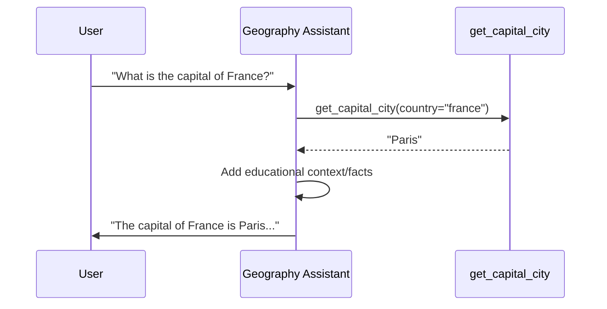
```mermaid
sequenceDiagram
    participant User
    participant Agent as Geography Assistant
    participant Tool as get_capital_city

    User->>Agent: "What is the capital of France?"
    Agent->>Tool: get_capital_city(country="france")
    Tool-->>Agent: "Paris"
    Agent->>Agent: Add educational context/facts
    Agent->>User: "The capital of France is Paris..."
```

#### Decision Logic Flow
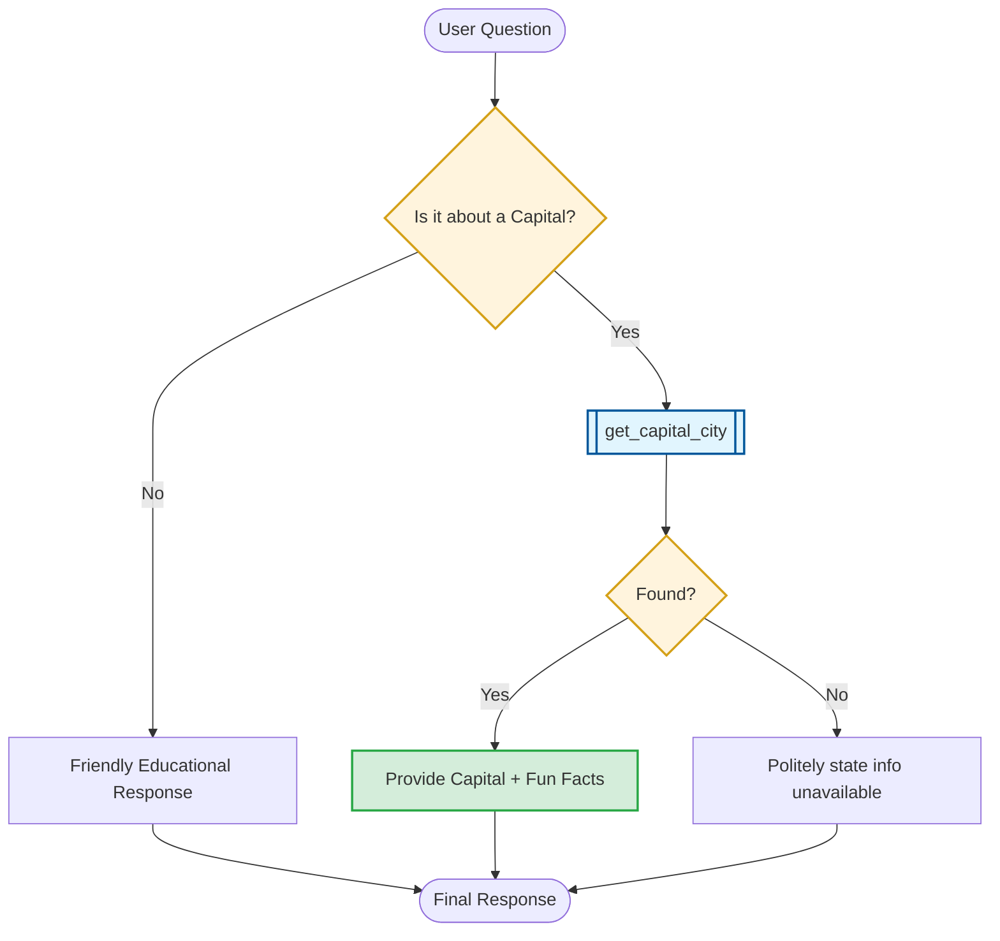
```mermaid
flowchart TD
    Start([User Question]) --> Intent{Is it about a Capital?}
    Intent -- No --> FriendlyResp[Friendly Educational Response]
    Intent -- Yes --> CallTool[[get_capital_city]]

    CallTool --> Result{Found?}
    Result -- Yes --> ProvideInfo[Provide Capital + Fun Facts]
    Result -- No --> Apologize[Politely state info unavailable]

    FriendlyResp --> End([Final Response])
    ProvideInfo --> End
    Apologize --> End

    %% Styling
    classDef tool fill:#e1f5fe,stroke:#01579b,stroke-width:2px;
    classDef decision fill:#fff4dd,stroke:#d4a017,stroke-width:2px;
    classDef success fill:#d4edda,stroke:#28a745,stroke-width:2px;

    class CallTool tool;
    class Intent,Result decision;
    class ProvideInfo success;
```

---

### 4. File Reader Assistant (MCP)
Explores and reads local files using the Model Context Protocol (MCP).
[Detailed Documentation](./geography_assistant_mcp/diagram.md)

#### Orchestration Sequence
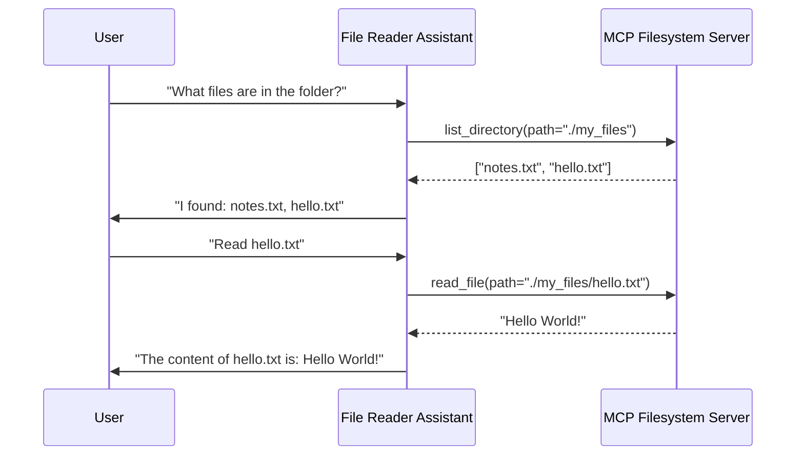
```mermaid
sequenceDiagram
    participant User
    participant Agent as File Reader Assistant
    participant MCP as MCP Filesystem Server

    User->>Agent: "What files are in the folder?"
    Agent->>MCP: list_directory(path="./my_files")
    MCP-->>Agent: ["notes.txt", "hello.txt"]
    Agent->>User: "I found: notes.txt, hello.txt"

    User->>Agent: "Read hello.txt"
    Agent->>MCP: read_file(path="./my_files/hello.txt")
    MCP-->>Agent: "Hello World!"
    Agent->>User: "The content of hello.txt is: Hello World!"
```

#### Decision Logic Flow
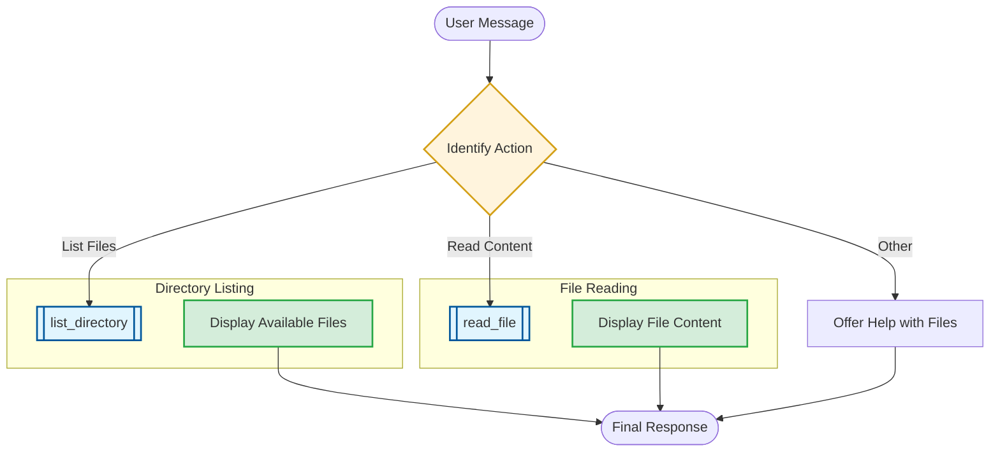
```mermaid
flowchart TD
    Start([User Message]) --> Identify{Identify Action}

    subgraph Explore [Directory Listing]
        CallList[[list_directory]]
        ListResult[Display Available Files]
    end

    subgraph Read [File Reading]
        CallRead[[read_file]]
        ReadResult[Display File Content]
    end

    Identify -- "List Files" --> CallList
    Identify -- "Read Content" --> CallRead
    Identify -- "Other" --> Help[Offer Help with Files]

    ListResult --> End([Final Response])
    ReadResult --> End
    Help --> End

    %% Styling
    classDef mcp fill:#e1f5fe,stroke:#01579b,stroke-width:2px;
    classDef success fill:#d4edda,stroke:#28a745,stroke-width:2px;
    classDef decision fill:#fff4dd,stroke:#d4a017,stroke-width:2px;

    class CallList,CallRead mcp;
    class Identify decision;
    class ListResult,ReadResult success;
```

---

### 5. Math Assistant
Uses built-in code execution for high-precision calculations.
[Detailed Documentation](./math_assistant/diagram.md)

#### Orchestration Sequence
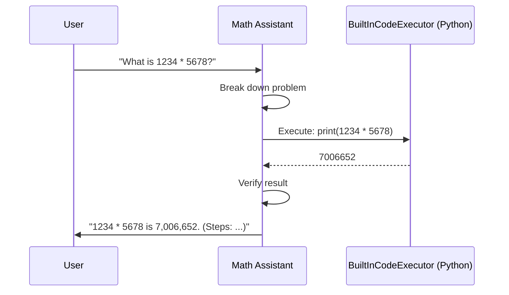
```mermaid
sequenceDiagram
    participant User
    participant Agent as Math Assistant
    participant Executor as BuiltInCodeExecutor (Python)

    User->>Agent: "What is 1234 * 5678?"
    Agent->>Agent: Break down problem
    Agent->>Executor: Execute: print(1234 * 5678)
    Executor-->>Agent: 7006652
    Agent->>Agent: Verify result
    Agent->>User: "1234 * 5678 is 7,006,652. (Steps: ...)"
```

#### Decision Logic Flow
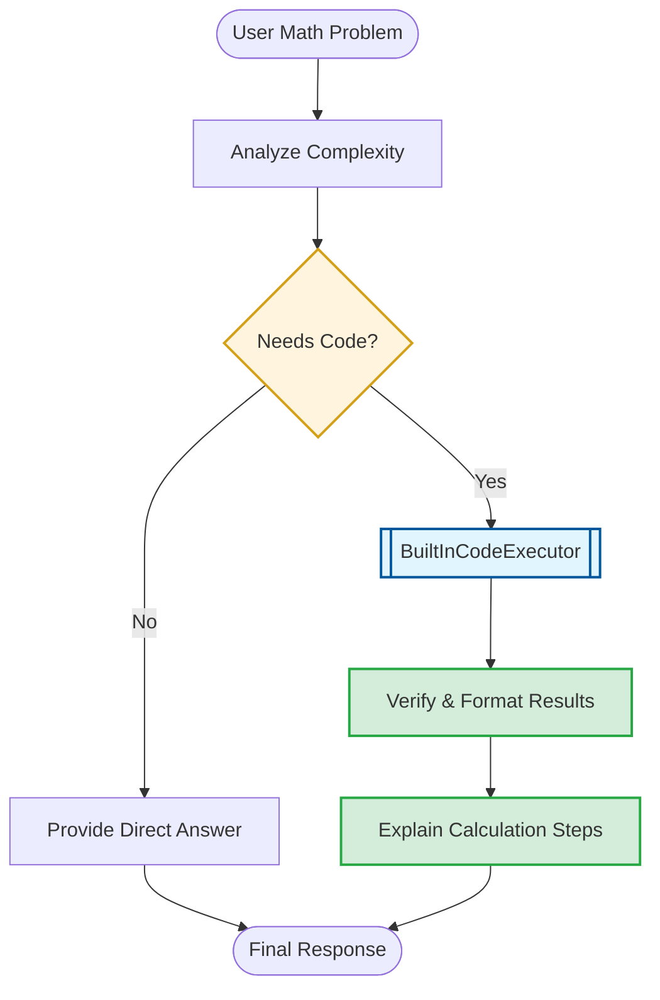
```mermaid
flowchart TD
    Start([User Math Problem]) --> Analyze[Analyze Complexity]
    Analyze --> Choice{Needs Code?}

    Choice -- No --> SimpleAns[Provide Direct Answer]
    Choice -- Yes --> CallExecutor[[BuiltInCodeExecutor]]

    CallExecutor --> Verify[Verify & Format Results]
    Verify --> Explain[Explain Calculation Steps]

    SimpleAns --> End([Final Response])
    Explain --> End

    %% Styling
    classDef tool fill:#e1f5fe,stroke:#01579b,stroke-width:2px;
    classDef success fill:#d4edda,stroke:#28a745,stroke-width:2px;
    classDef decision fill:#fff4dd,stroke:#d4a017,stroke-width:2px;

    class CallExecutor tool;
    class Choice decision;
    class Verify,Explain success;
```

---

### 6. Model Comparison
Demonstrates different configurations for factual vs. creative tasks.
[Detailed Documentation](./model_comparison/diagram.md)

#### Orchestration Sequence
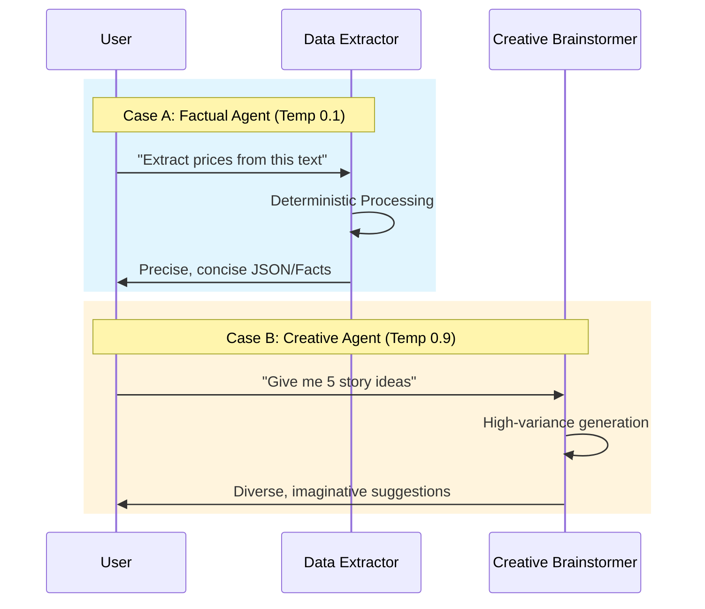
```mermaid
sequenceDiagram
    participant User
    
    rect rgb(225, 245, 254)
    Note over User, AgentF: Case A: Factual Agent (Temp 0.1)
    participant AgentF as Data Extractor
    User->>AgentF: "Extract prices from this text"
    AgentF->>AgentF: Deterministic Processing
    AgentF->>User: Precise, concise JSON/Facts
    end

    rect rgb(255, 244, 221)
    Note over User, AgentC: Case B: Creative Agent (Temp 0.9)
    participant AgentC as Creative Brainstormer
    User->>AgentC: "Give me 5 story ideas"
    AgentC->>AgentC: High-variance generation
    AgentC->>User: Diverse, imaginative suggestions
    end
```

#### Decision Logic Flow
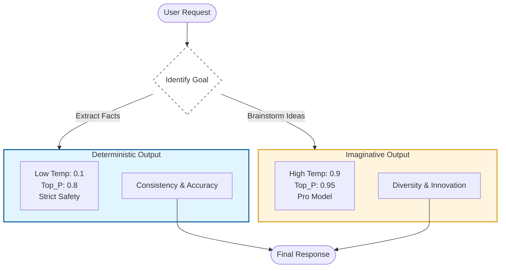
```mermaid
flowchart TD
    Start([User Request]) --> Goal{Identify Goal}

    subgraph Factual [Deterministic Output]
        FConfig[Low Temp: 0.1<br/>Top_P: 0.8<br/>Strict Safety]
        FGoal[Consistency & Accuracy]
    end

    subgraph Creative [Imaginative Output]
        CConfig[High Temp: 0.9<br/>Top_P: 0.95<br/>Pro Model]
        CGoal[Diversity & Innovation]
    end

    Goal -- "Extract Facts" --> Factual
    Goal -- "Brainstorm Ideas" --> Creative

    FGoal --> End([Final Response])
    CGoal --> End

    %% Styling
    classDef factual fill:#e1f5fe,stroke:#01579b,stroke-width:2px;
    classDef creative fill:#fff4dd,stroke:#d4a017,stroke-width:2px;
    classDef decision fill:#ffffff,stroke:#333,stroke-dasharray: 5 5;

    class Factual factual;
    class Creative creative;
    class Goal decision;
```

---

### 7. Math Tutor
Algebra tutor that uses scaffolded steps and positive reinforcement.
[Detailed Documentation](./my_first_agent/diagram.md)

#### Orchestration Sequence
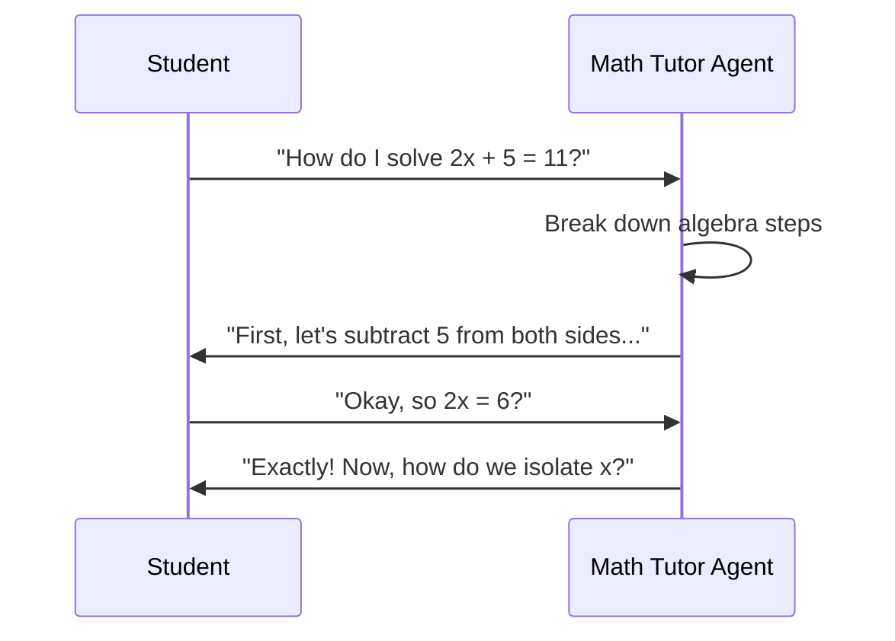
```mermaid
sequenceDiagram
    participant Student
    participant Tutor as Math Tutor Agent

    Student->>Tutor: "How do I solve 2x + 5 = 11?"
    Tutor->>Tutor: Break down algebra steps
    Tutor->>Student: "First, let's subtract 5 from both sides..."
    Student->>Tutor: "Okay, so 2x = 6?"
    Tutor->>Student: "Exactly! Now, how do we isolate x?"
```

#### Decision Logic Flow
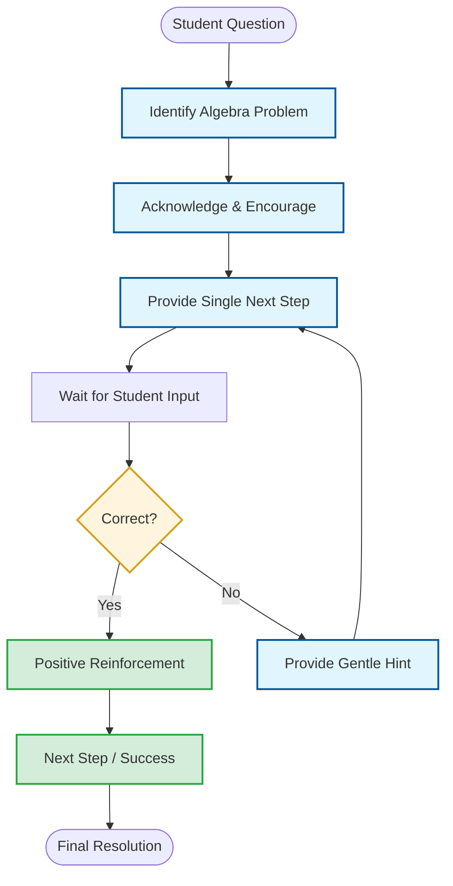
```mermaid
flowchart TD
    Start([Student Question]) --> Analyze[Identify Algebra Problem]
    Analyze --> Encourage[Acknowledge & Encourage]
    Encourage --> StepByStep[Provide Single Next Step]
    
    StepByStep --> Wait[Wait for Student Input]
    Wait --> Verify{Correct?}
    
    Verify -- Yes --> Positive[Positive Reinforcement]
    Verify -- No --> Hint[Provide Gentle Hint]

    Positive --> NextStep[Next Step / Success]
    Hint --> StepByStep
    
    NextStep --> End([Final Resolution])

    %% Styling
    classDef process fill:#e1f5fe,stroke:#01579b,stroke-width:2px;
    classDef decision fill:#fff4dd,stroke:#d4a017,stroke-width:2px;
    classDef success fill:#d4edda,stroke:#28a745,stroke-width:2px;

    class Analyze,Encourage,StepByStep,Hint process;
    class Verify decision;
    class Positive,NextStep success;
```

---

### 8. Strategic Problem Solver
Uses a multi-step thinking process and reasoning budget for complex tasks.
[Detailed Documentation](./problem_solver/diagram.md)

#### Orchestration Sequence
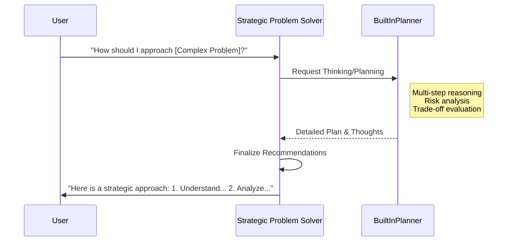
```mermaid
sequenceDiagram
    participant User
    participant Agent as Strategic Problem Solver
    participant Planner as BuiltInPlanner

    User->>Agent: "How should I approach [Complex Problem]?"
    Agent->>Planner: Request Thinking/Planning
    Note right of Planner: Multi-step reasoning<br/>Risk analysis<br/>Trade-off evaluation
    Planner-->>Agent: Detailed Plan & Thoughts
    Agent->>Agent: Finalize Recommendations
    Agent->>User: "Here is a strategic approach: 1. Understand... 2. Analyze..."
```

#### Decision Logic Flow
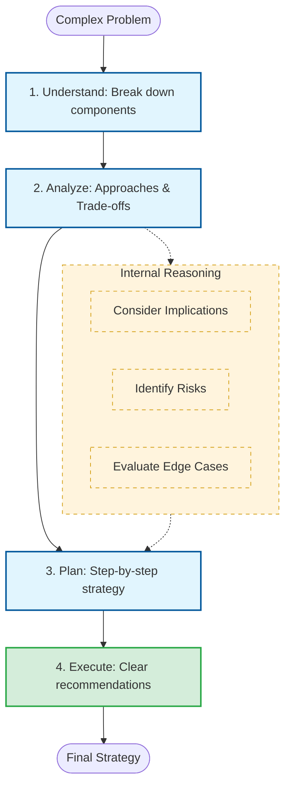
```mermaid
flowchart TD
    Start([Complex Problem]) --> Understand[1. Understand: Break down components]
    Understand --> Analyze[2. Analyze: Approaches & Trade-offs]
    Analyze --> Plan[3. Plan: Step-by-step strategy]
    Plan --> Execute[4. Execute: Clear recommendations]

    subgraph Thinking [Internal Reasoning]
        Direction[Consider Implications]
        Risks[Identify Risks]
        EdgeCases[Evaluate Edge Cases]
    end

    Analyze -.-> Thinking
    Thinking -.-> Plan

    Execute --> End([Final Strategy])

    %% Styling
    classDef process fill:#e1f5fe,stroke:#01579b,stroke-width:2px;
    classDef thinking fill:#fff4dd,stroke:#d4a017,stroke-width:1px,stroke-dasharray: 5 5;
    classDef success fill:#d4edda,stroke:#28a745,stroke-width:2px;

    class Understand,Analyze,Plan process;
    class Thinking,Direction,Risks,EdgeCases thinking;
    class Execute success;
```

---

### 9. Product Extractor
Transforms natural language into structured JSON data.
[Detailed Documentation](./product_extractor/diagram.md)

#### Orchestration Sequence
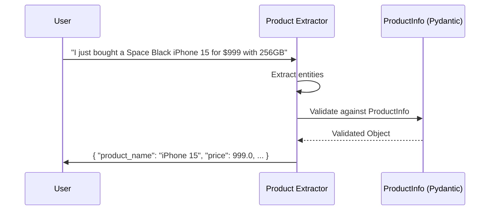
```mermaid
sequenceDiagram
    participant User
    participant Agent as Product Extractor
    participant Schema as ProductInfo (Pydantic)

    User->>Agent: "I just bought a Space Black iPhone 15 for $999 with 256GB"
    Agent->>Agent: Extract entities
    Agent->>Schema: Validate against ProductInfo
    Schema-->>Agent: Validated Object
    Agent->>User: { "product_name": "iPhone 15", "price": 999.0, ... }
```

#### Decision Logic Flow
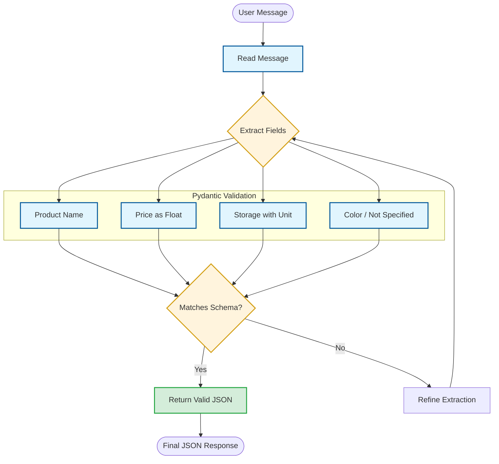
```mermaid
flowchart TD
    Start([User Message]) --> Parse[Read Message]
    Parse --> Extract{Extract Fields}

    subgraph Validation [Pydantic Validation]
        Name[Product Name]
        Price[Price as Float]
        Storage[Storage with Unit]
        Color[Color / Not Specified]
    end

    Extract --> Name
    Extract --> Price
    Extract --> Storage
    Extract --> Color

    Name & Price & Storage & Color --> SchemaMatch{Matches Schema?}
    
    SchemaMatch -- Yes --> OutputJSON[Return Valid JSON]
    SchemaMatch -- No --> Retry[Refine Extraction]
    
    Retry --> Extract
    OutputJSON --> End([Final JSON Response])

    %% Styling
    classDef process fill:#e1f5fe,stroke:#01579b,stroke-width:2px;
    classDef decision fill:#fff4dd,stroke:#d4a017,stroke-width:2px;
    classDef success fill:#d4edda,stroke:#28a745,stroke-width:2px;

    class Parse,Name,Price,Storage,Color process;
    class Extract,SchemaMatch decision;
    class OutputJSON success;
```

---

### 10. Research Assistant
Uses Google Search grounding for real-time information and source citation.
[Detailed Documentation](./research_assistant/diagram.md)

#### Orchestration Sequence
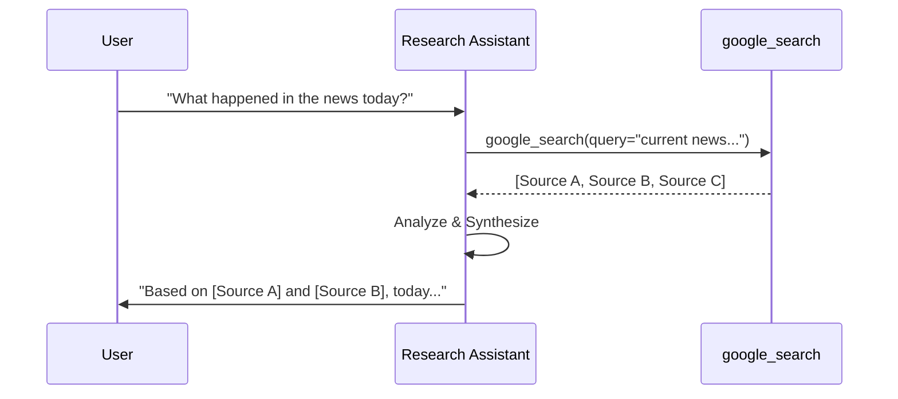
```mermaid
sequenceDiagram
    participant User
    participant Agent as Research Assistant
    participant Tool as google_search

    User->>Agent: "What happened in the news today?"
    Agent->>Tool: google_search(query="current news...")
    Tool-->>Agent: [Source A, Source B, Source C]
    Agent->>Agent: Analyze & Synthesize
    Agent->>User: "Based on [Source A] and [Source B], today..."
```

#### Decision Logic Flow
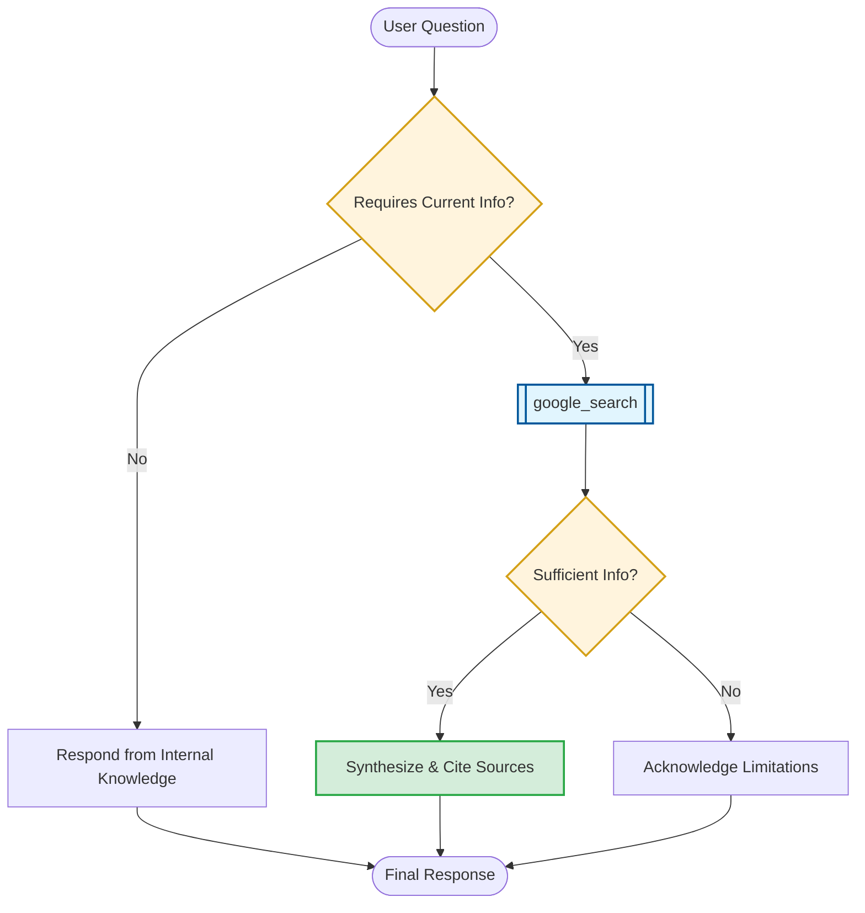
```mermaid
flowchart TD
    Start([User Question]) --> Intent{Requires Current Info?}
    
    Intent -- No --> KnowledgeBase[Respond from Internal Knowledge]
    Intent -- Yes --> CallSearch[[google_search]]

    CallSearch --> Result{Sufficient Info?}
    
    Result -- Yes --> Synthesize[Synthesize & Cite Sources]
    Result -- No --> Limitations[Acknowledge Limitations]

    KnowledgeBase --> End([Final Response])
    Synthesize --> End
    Limitations --> End

    %% Styling
    classDef tool fill:#e1f5fe,stroke:#01579b,stroke-width:2px;
    classDef success fill:#d4edda,stroke:#28a745,stroke-width:2px;
    classDef decision fill:#fff4dd,stroke:#d4a017,stroke-width:2px;

    class CallSearch tool;
    class Intent,Result decision;
    class Synthesize success;
```

---

### 11. Travel Agent
Coordinates flights, hotels, and budget calculations for trip planning.
[Detailed Documentation](./travel_agent/diagram.md)

#### Orchestration Sequence
```mermaid
sequenceDiagram
    participant User
    participant Agent as Travel Agent
    participant Tools as Toolset (Python)

    User->>Agent: "Plan a 3-night trip to Paris"
    
    rect rgb(225, 245, 254)
    Note over Agent,Tools: Step 1: Search Flights
    Agent->>Tools: search_flights(destination="Paris", ...)
    Tools-->>Agent: {"status":"success", "flights": [...]}
    end

    rect rgb(225, 245, 254)
    Note over Agent,Tools: Step 2: Search Hotels
    Agent->>Tools: search_hotels(city="Paris", ...)
    Tools-->>Agent: {"status":"success", "hotels": [...]}
    end

    rect rgb(225, 245, 254)
    Note over Agent,Tools: Step 3: Calculate Budget
    Agent->>Tools: calculate_trip_budget(flight_price=450, hotel_price=150, num_nights=3)
    Tools-->>Agent: {"status":"success", "total_usd": 900, ...}
    end

    Agent->>User: Present options & total estimate
```

#### Decision Logic Flow
```mermaid
flowchart TD
    Start([User Message]) --> Intent{Identify Intent}

    subgraph Flights [Flight Search]
        CallFlights[[search_flights]]
        FlightResult{Success?}
    end

    subgraph Hotels [Hotel Search]
        CallHotels[[search_hotels]]
        HotelResult{Success?}
    end

    subgraph Budget [Budget Calculation]
        CallBudget[[calculate_trip_budget]]
    end

    Intent -- Flights --> CallFlights
    Intent -- Hotels --> CallHotels
    Intent -- "Full Estimate" --> CallFlights
    
    FlightResult -- Yes --> CallHotels
    HotelResult -- Yes --> CallBudget
    
    FlightResult -- No --> Suggest[Suggest Paris/Tokyo]
    HotelResult -- No --> Suggest

    CallBudget --> Present[Present Total & Options]
    Suggest --> End([Final Response])
    Present --> End

    %% Styling
    classDef tool fill:#e1f5fe,stroke:#01579b,stroke-width:2px;
    classDef decision fill:#fff4dd,stroke:#d4a017,stroke-width:2px;
    classDef success fill:#d4edda,stroke:#28a745,stroke-width:2px;

    class CallFlights,CallHotels,CallBudget tool;
    class Intent,FlightResult,HotelResult decision;
    class Present success;
```
