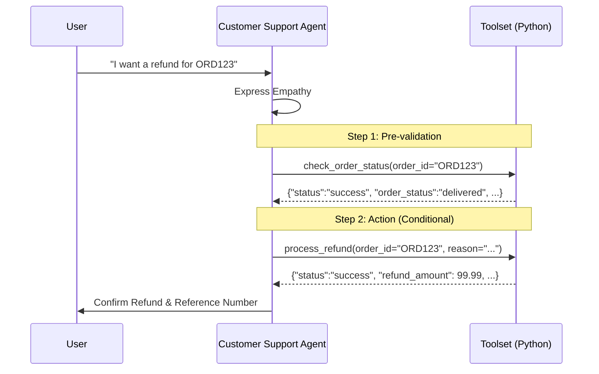
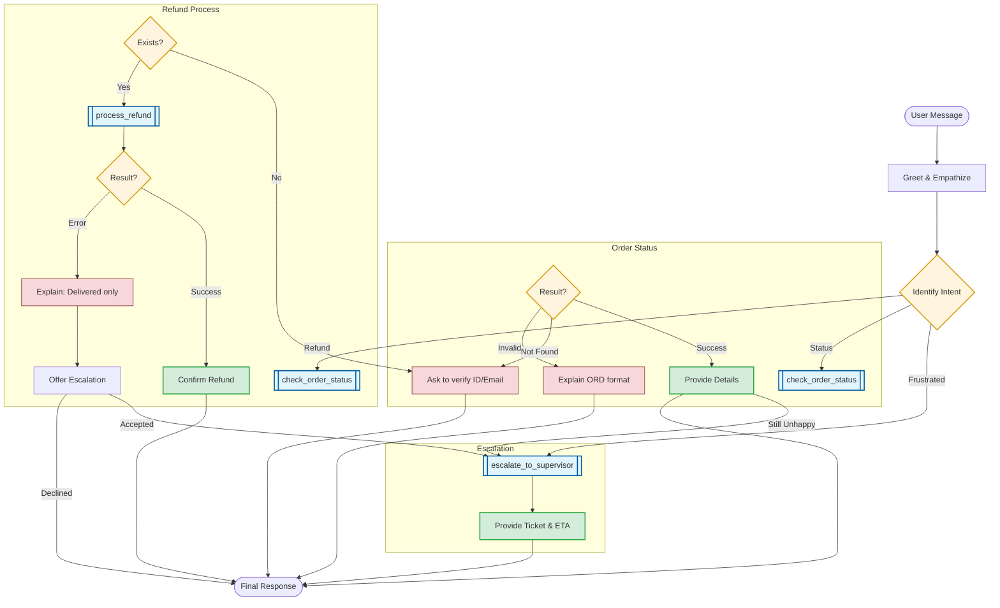

# Customer Support Agent: Strategy & Logic

This document details the orchestration logic and tool coordination for the `customer_support` agent.

## 1. Orchestration Sequence
The following sequence diagram illustrates the "Verification-First" pattern and how the agent coordinates multiple tools to fulfill complex requests like refunds.

## 2. Decision Logic Flow
The flowchart below maps out the comprehensive error handling and escalation paths for all supported intents.

## 3. Communication Guidelines
*   **Empathy First**: Always acknowledge the customer's feelings before tool use.
*   **Recovery Oriented**: When a tool fails (e.g., `not_found`), always provide a specific path forward (re-verify or search by email).
*   **Proactive Escalation**: Always offer a supervisor if a refund is denied due to policy.
