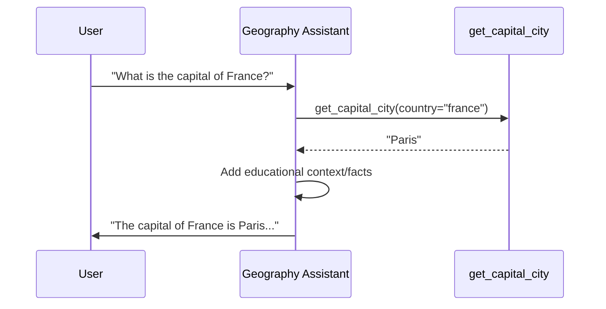
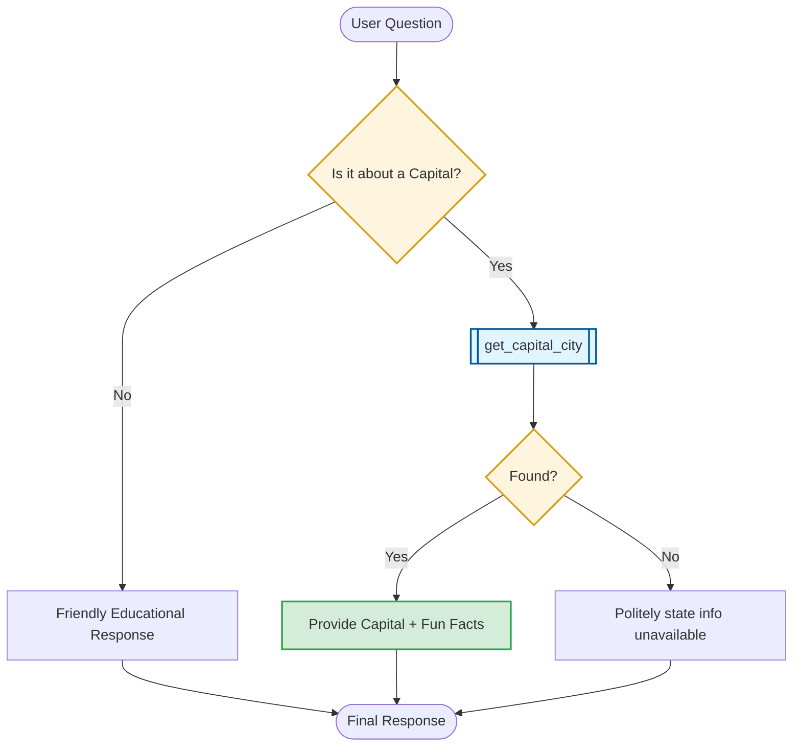

# Geography Assistant: Knowledge & Education

This document details the tool orchestration and educational strategy for the `geography_assistant`.

## 1. Orchestration Sequence
The following sequence diagram illustrates how the agent retrieves capital city information using its dedicated tool.

## 2. Decision Logic Flow
The flowchart below maps out the lookup process and error handling.

## 3. Communication Guidelines
*   **Educational Tone**: Always aim to be friendly and educational, not just providing data.
*   **Proactive Enrichment**: Add interesting geography facts when possible.
*   **Graceful Failure**: If a country isn't in the database, apologize politely and maintain a helpful attitude.
