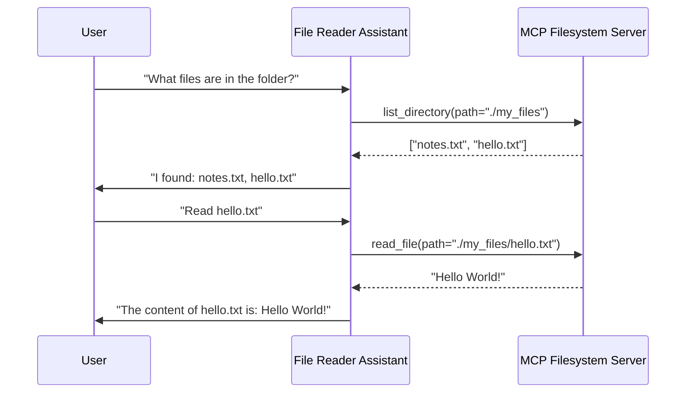
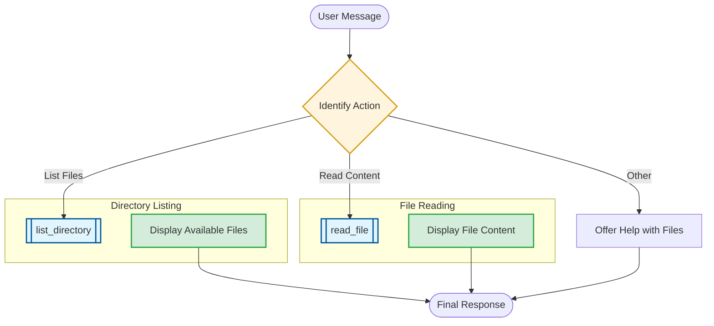

# File Reader Assistant: MCP Integration

This document details the tool orchestration and filesystem exploration strategy for the `geography_assistant_mcp` (File Reader Assistant).

## 1. Orchestration Sequence
The following sequence diagram illustrates the "Explore-and-Read" pattern using MCP filesystem tools.

## 2. Decision Logic Flow
The flowchart below maps out the file exploration and retrieval process.

## 3. Communication Guidelines
*   **Contextual Awareness**: Always be clear about which folder and files are being accessed.
*   **Descriptive Discovery**: When listing files, describe them in a way that helps the user decide what to read next.
*   **Security Focus**: Only operate within the `ALLOWED_PATH` configured for the MCP server.
