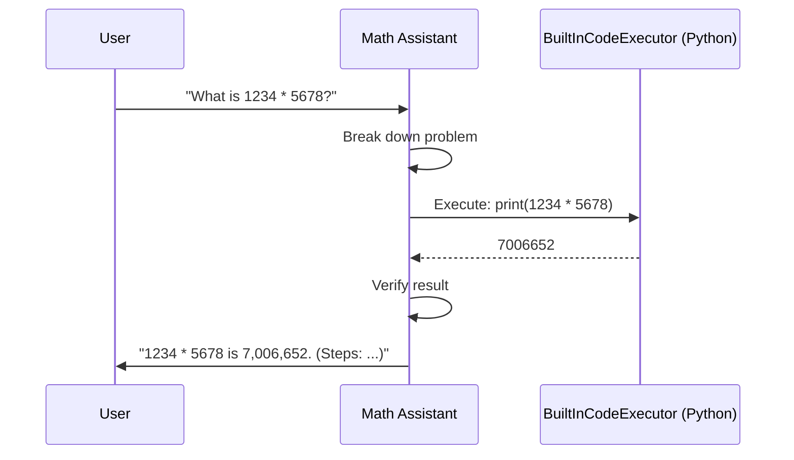
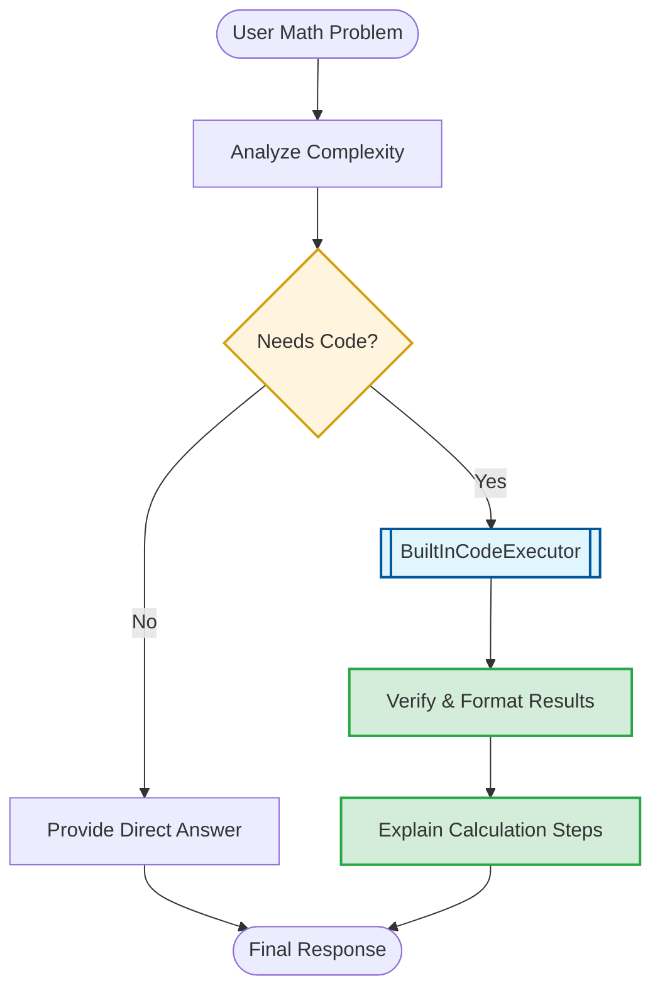

# Math Assistant: Code Execution for Precision

This document details the code execution orchestration and verification logic for the `math_assistant`.

## 1. Orchestration Sequence
The following sequence diagram illustrates how the agent uses the built-in code executor to solve mathematical problems.

## 2. Decision Logic Flow
The flowchart below maps out the calculation and explanation strategy.

## 3. Communication Guidelines
*   **Precision First**: Use code execution for complex calculations to ensure accuracy.
*   **Show Your Work**: Always explain the mathematical steps taken to arrive at the result.
*   **Verification**: Run code to verify results before presenting them to the user.
*   **Broad Capability**: Handle statistics, algebra, and other complex operations systematically.
