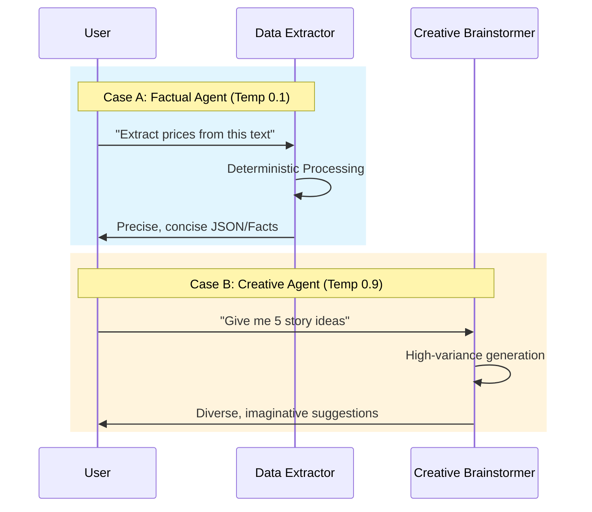
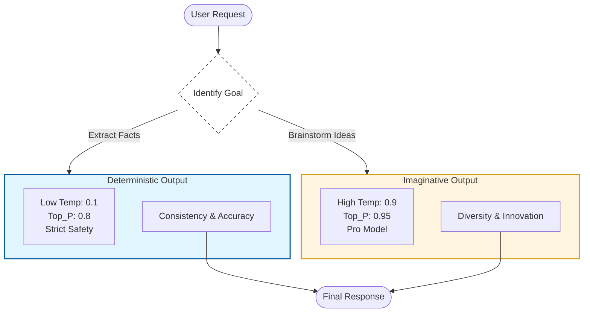

# Model Comparison: Factual vs Creative

This document details the configuration strategy for the two specialized agents in the `model_comparison` project.

## 1. Orchestration Sequence
The following sequence diagram illustrates how a user interaction differs based on the chosen agent's configuration.

## 2. Decision Logic Flow
The flowchart below maps out the architectural optimization for different use cases.

## 3. Configuration Guidelines
*   **Temperature (0.1)**: Used for `data_extractor` to ensure factual consistency and minimize hallucinations.
*   **Temperature (0.9)**: Used for `creative_brainstormer` to encourage "outside the box" thinking and diverse outputs.
*   **Safety Thresholds**: Adjusted based on use case—stricter for factual data, more permissive for creative exploration.
*   **Model Selection**: Uses `gemini-3-flash` for fast factual extraction and `gemini-3.1-pro` for high-quality creative reasoning.
