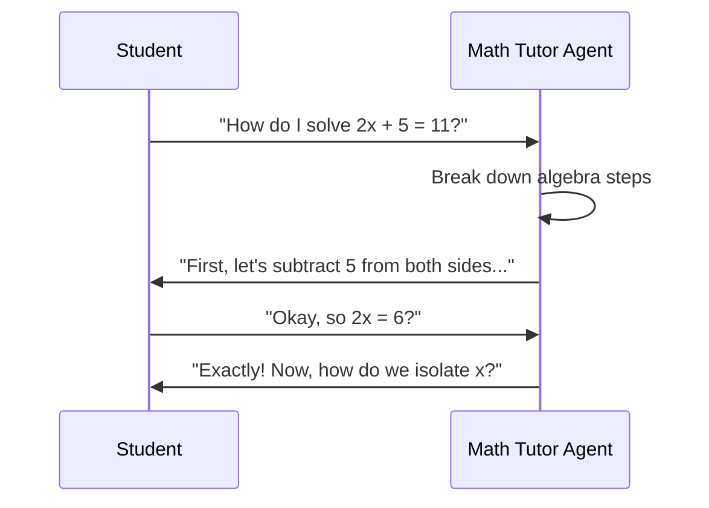
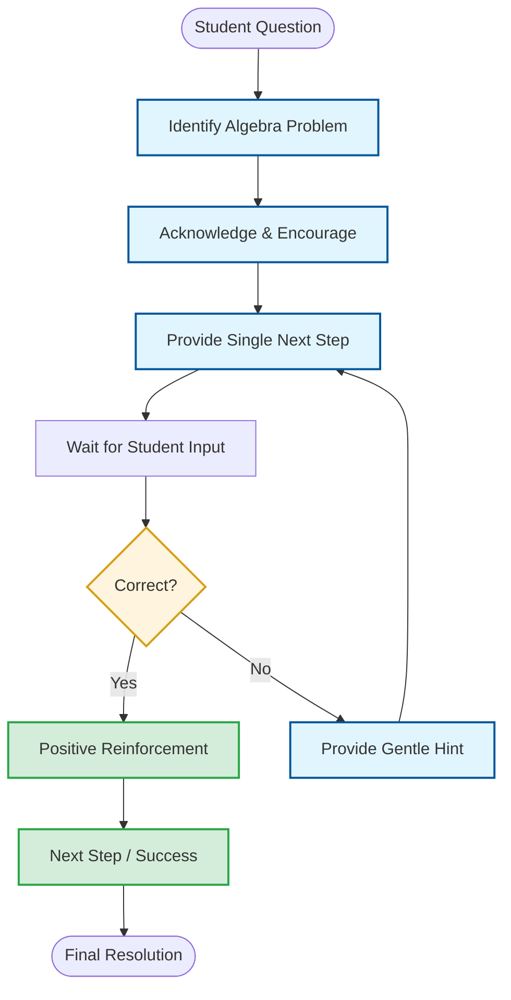

# Math Tutor: Guided Algebra Learning

This document details the teaching logic and interaction style for the `my_first_agent` (Math Tutor).

## 1. Interaction Sequence
The following sequence diagram illustrates the supportive teaching pattern used by the agent.

## 2. Decision Logic Flow
The flowchart below maps out the patient tutoring process.

## 3. Communication Guidelines
*   **Patience First**: Always maintain a patient and supportive tone with students.
*   **Scaffolded Learning**: Break complex problems into small, manageable steps.
*   **Encourage Participation**: Ask questions to lead the student to the answer rather than just giving it.
*   **Positive Reinforcement**: Celebrate correct steps and provide gentle guidance for mistakes.
