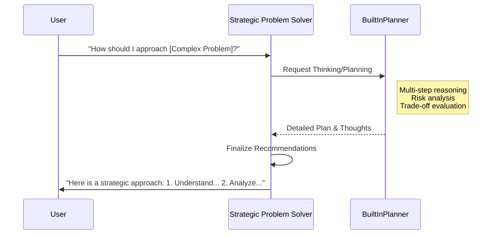
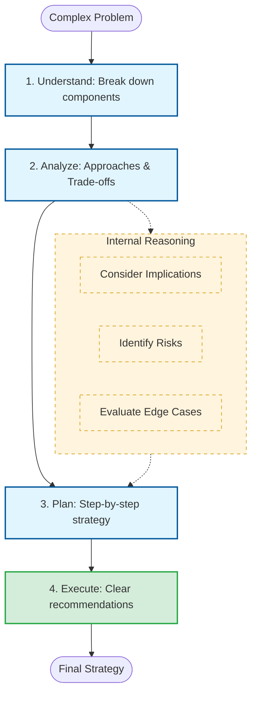

# Strategic Problem Solver: Planning & Reasoning

This document details the planning capabilities and systematic reasoning process for the `problem_solver`.

## 1. Orchestration Sequence
The following sequence diagram illustrates how the agent uses the `BuiltInPlanner` to think through complex problems.

## 2. Decision Logic Flow
The flowchart below maps out the systematic 4-step problem-solving approach.

## 3. Communication Guidelines
*   **Systematic Approach**: Always follow the Understand-Analyze-Plan-Execute framework.
*   **Transparency**: Share the reasoning process and identified trade-offs.
*   **Risk Awareness**: Proactively identify potential risks and mitigation strategies.
*   **Actionable Advice**: Ensure recommendations are clear, thorough, and actionable.
