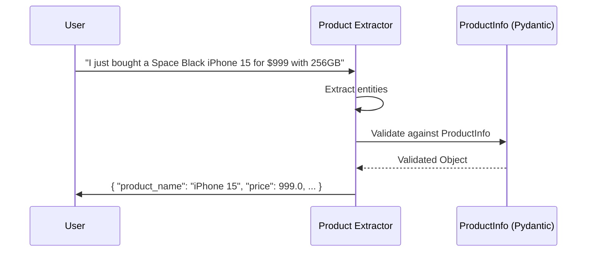
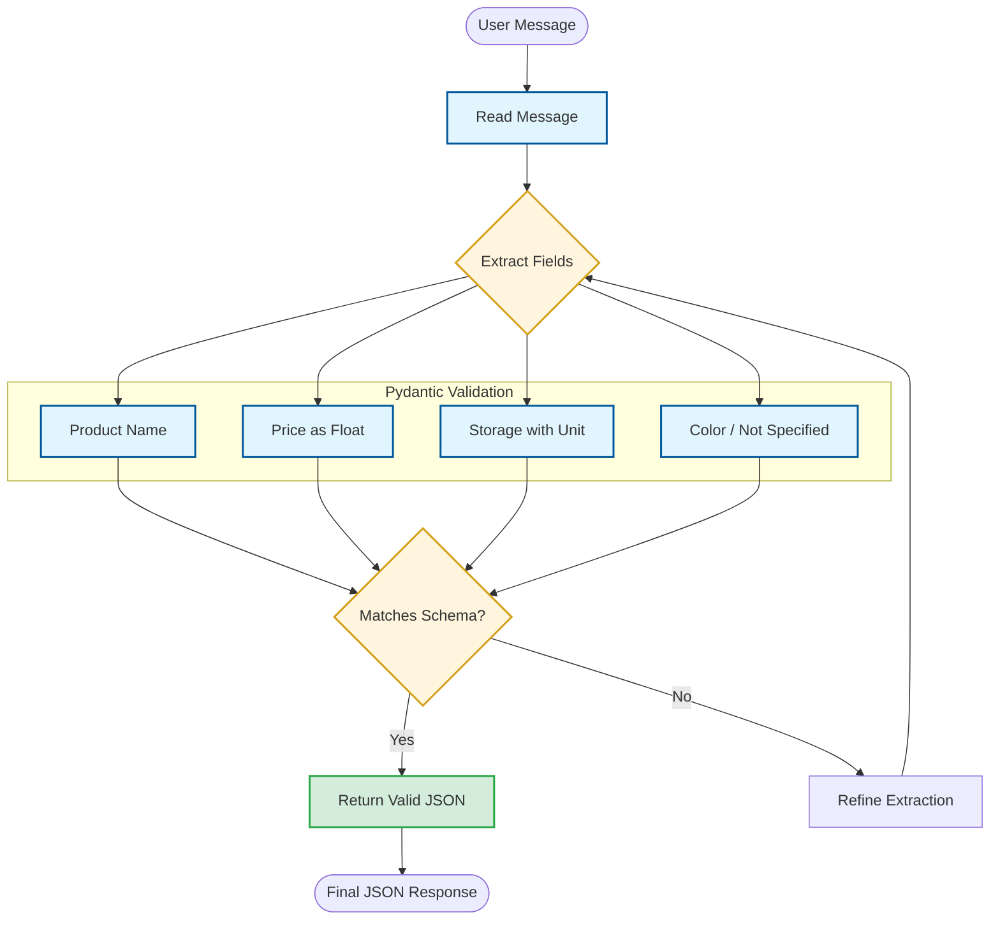

# Product Extractor: Structured JSON Output

This document details the extraction logic and structured data schema for the `product_extractor`.

## 1. Interaction Sequence
The following sequence diagram illustrates how the agent transforms natural language into structured JSON data.

## 2. Decision Logic Flow
The flowchart below maps out the extraction and validation process.

## 3. Communication Guidelines
*   **JSON Only**: Respond ONLY with valid JSON matching the `ProductInfo` schema.
*   **Strict Typing**: Ensure prices are numbers (no currency symbols) and storage includes units (GB/TB).
*   **Default Handling**: If color is not mentioned, always use "Not specified".
*   **No Preamble**: Do not include conversational filler or explanation text in the output.
