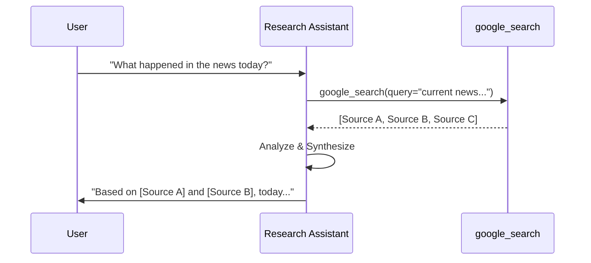
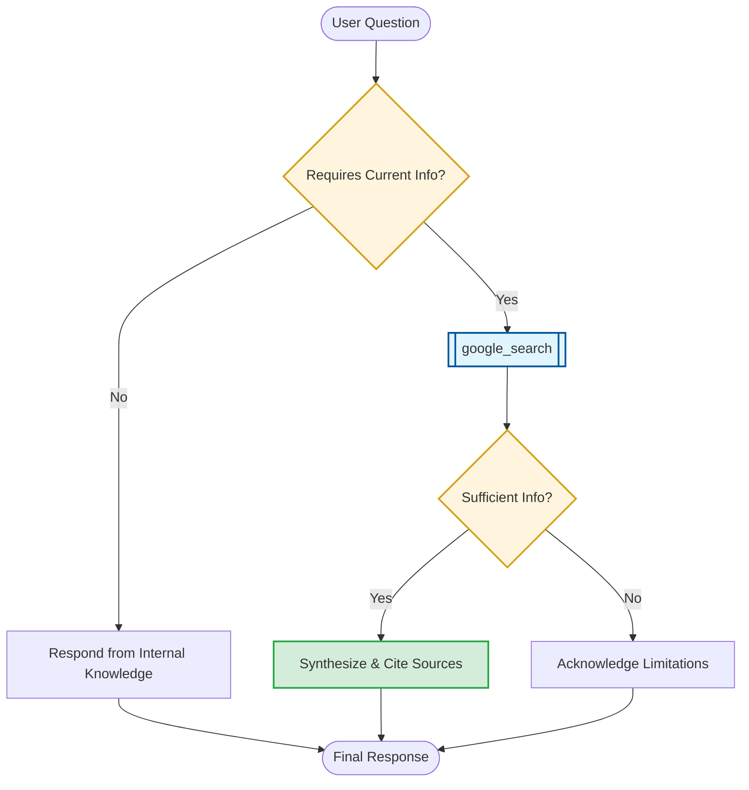

# Research Assistant: Real-Time Grounding

This document details the tool orchestration and source-citing strategy for the `research_assistant`.

## 1. Orchestration Sequence
The following sequence diagram illustrates how the agent uses Google Search to provide up-to-date information.

## 2. Decision Logic Flow
The flowchart below maps out the search and citation process.

## 3. Communication Guidelines
*   **Prioritize Accuracy**: Always prioritize factual accuracy over speculative generation.
*   **Mandatory Citation**: Always cite sources when providing information found via Google Search.
*   **Acknowledge Limitations**: If search results are insufficient or ambiguous, be honest about what you cannot find.
*   **Up-to-Date Focus**: Use Google Search whenever a query involves current events or rapidly changing information.
