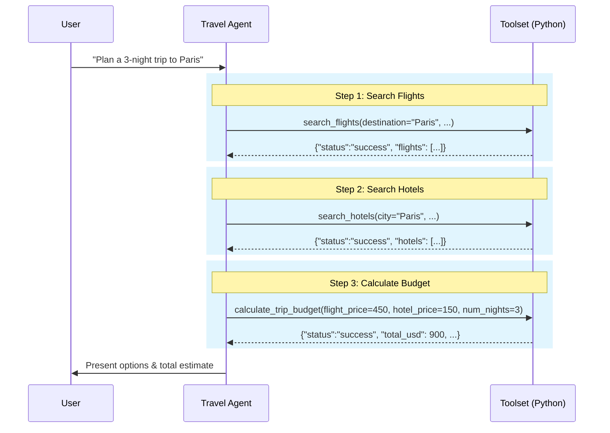
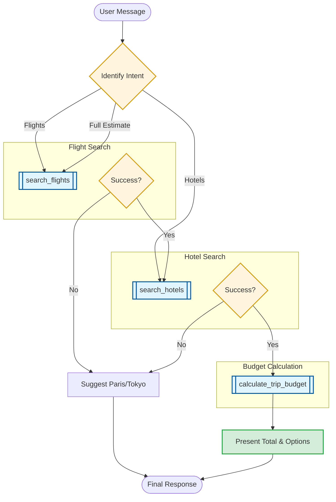

# Travel Agent: Flight & Hotel Orchestration

This document details the tool coordination and budget calculation logic for the `travel_agent`.

## 1. Orchestration Sequence
The following sequence diagram illustrates the multi-tool workflow for a full trip estimate.

## 2. Decision Logic Flow
The flowchart below maps out the intent identification and tool selection process.

## 3. Communication Guidelines
*   **Comprehensive Planning**: When a full trip is requested, always coordinate flights, hotels, and budget calculations.
*   **Clear Presentation**: Present options with flight numbers, hotel names, and specific prices clearly formatted.
*   **Error Recovery**: If a destination is unsupported, suggest "Paris" or "Tokyo" as available alternatives.
*   **Friendly Assistance**: Maintain a helpful, enthusiastic "Travel Agent" persona throughout the interaction.
