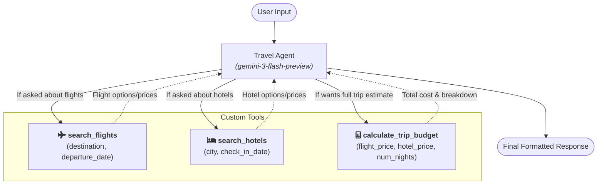

# Travel Agent Architecture

Here is a Mermaid diagram representing the flow and structure of the `travel_agent`. It illustrates the LLM acting as the central router that invokes specific custom tools based on the user's input:

### Breakdown of the Agent Logic:
* **The Agent (`gemini-3-flash-preview`)**: Acts as the central orchestrator, analyzing the intent of the user.
* **`search_flights`**: Triggered when the user asks for flight availability to supported destinations (Paris or Tokyo).
* **`search_hotels`**: Triggered when the user needs accommodations in a specific city.
* **`calculate_trip_budget`**: Triggered after pulling flight and hotel prices to give a final breakdown of the trip's estimated cost. 

The agent iterates over these tools until it has all the necessary information to present the final trip details clearly to the user.
